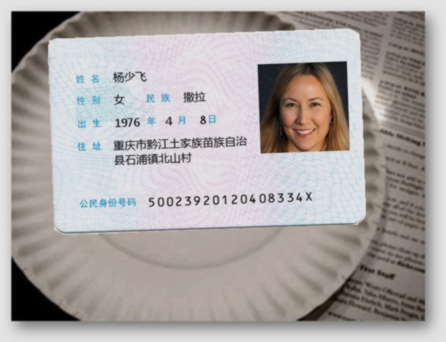

# 合成证件数据集

本仓库合成证件数据，主要用于在论文中引用合成图像进行示意，所有证件都是虚拟不存在的。

> 免责声明： 使用本仓库数据请遵守当地法律法规，作者不承担任何责任。



### 引用格式

```
@misc{laygincard,
  title={synthetic identity card dataset},
  author={laygin},
  year=2023,
  howpublished={\url{https://github.com/opconty/card_generator}}
}
```

### 参考
1. [CardMaker.py](https://github.com/linglanfeng/CCF2019-OCR/blob/master/ccf2019-ocr-cardmaker/CardMaker.py)
2. 人脸数据：采用GAN方法生成，详见https://github.com/NVlabs/stylegan3